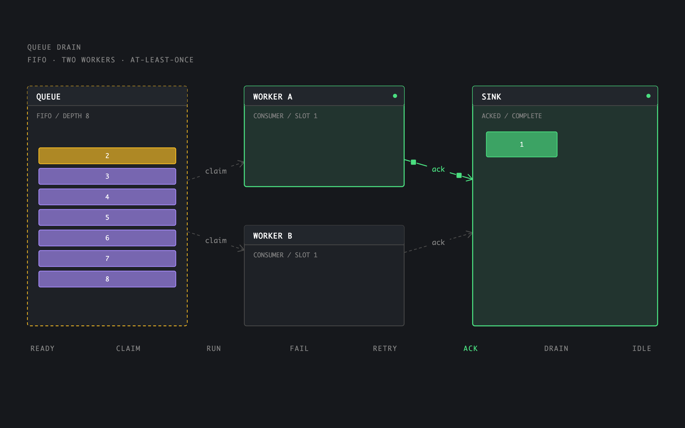
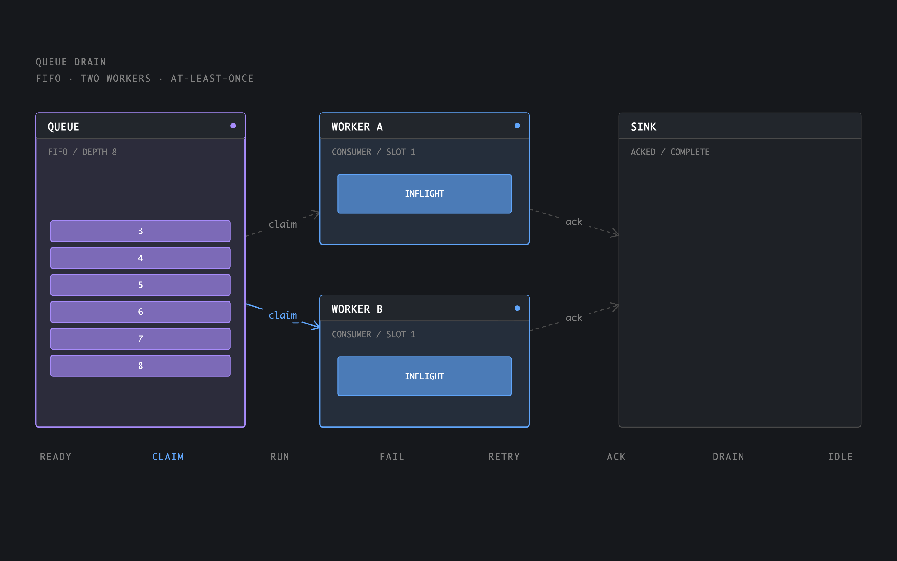
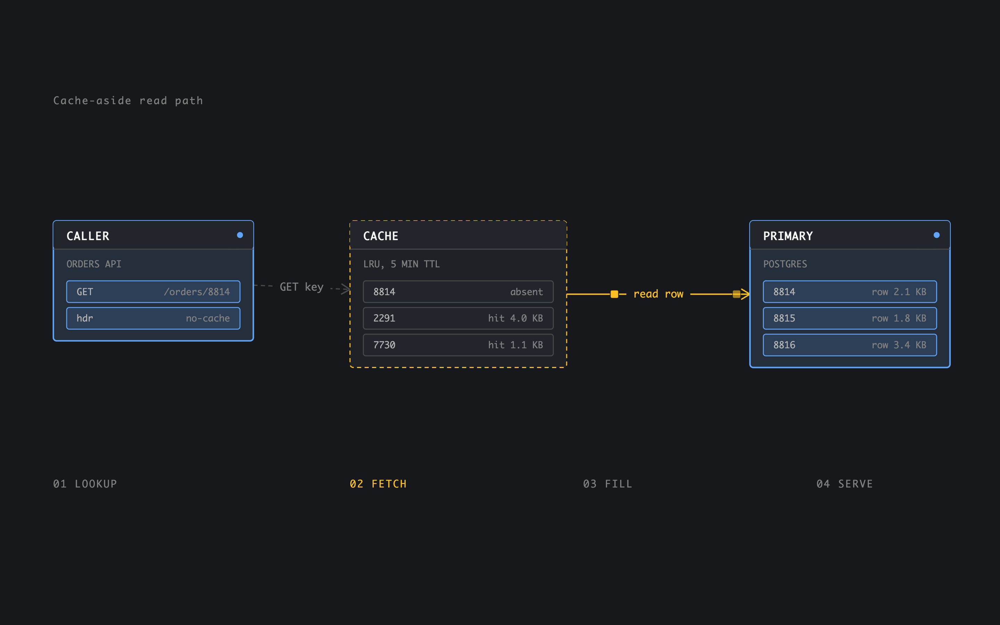

# Animation for BB

Step-based explainer diagrams for BB, stored as plain `.scene.json` files.

This is a BB port of [Nimbalyst Animation](https://nimbalyst.com/extensions/animation/): a named scene plus an ordered list of steps. Each step assigns states to parts — a node becomes `active`, an edge starts `flowing` — and CSS transitions interpolate. There are no keyframes or easing curves.

The document format is compatible with Nimbalyst Animation files. Existing `.anim.json` documents still open; new files use `.scene.json`. The parser, serializer, timeline, and stage renderer are adapted from that MIT-licensed extension.

## Surfaces

- **File opener** for `*.scene.json` and `*.anim.json` (registered on `json`, then delegated back to BB's preview for other JSON files)
- **New animation** from the thread panel or command palette
- **Settings** page under BB Settings (how to create, open, and export)
- Timeline editor: play, scrub, retime by dragging a step boundary
- Click a part to quote its current state into chat
- `bb animation new|validate|export`
- Agent tools `animation_export_html` and `animation_validate`
- Chat embed: `::scene{file="docs/flow.scene.json"}` (`::animation` still works)

GIF and MP4 export are not included. Use HTML export when you need something outside BB.

## Showcase

Queue drain (fail/retry beat):



Queue drain (both workers claiming):



Cache-aside:



## Install

```
cd bb-plugin-animation
npm install
bb plugin install . --yes
```

Open a `.scene.json` file from the workspace, or create one with:

```
bb animation new docs/cache-read.scene.json
```

After editing sources:

```
bb plugin reload animation
```

Or run `bb plugin dev` for rebuild-on-save.

## Commands

```
bb animation new <path>
bb animation validate <path>
bb animation export <path> [--out <html-path>]
```

Add `--json` when the output drives code.

## Tests

```
npm test
npx tsc --noEmit
```
