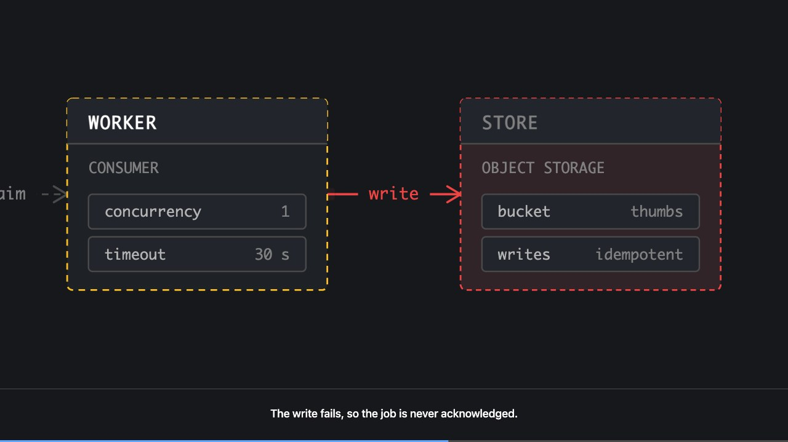
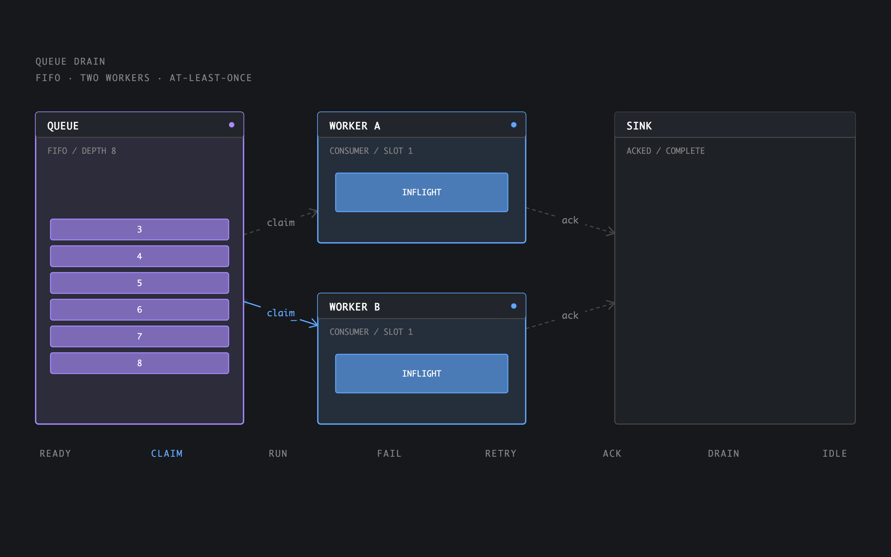
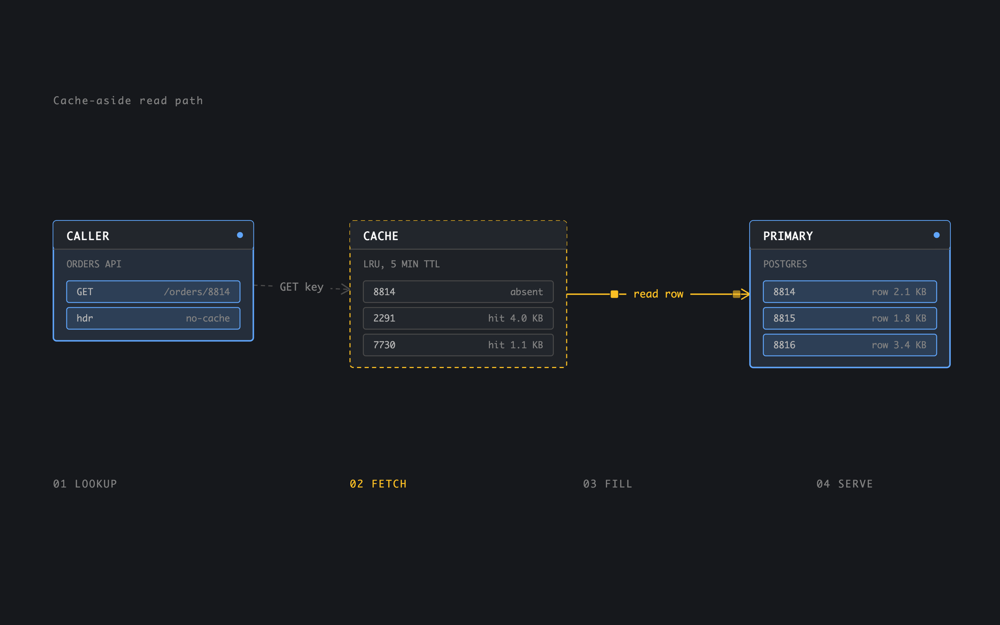
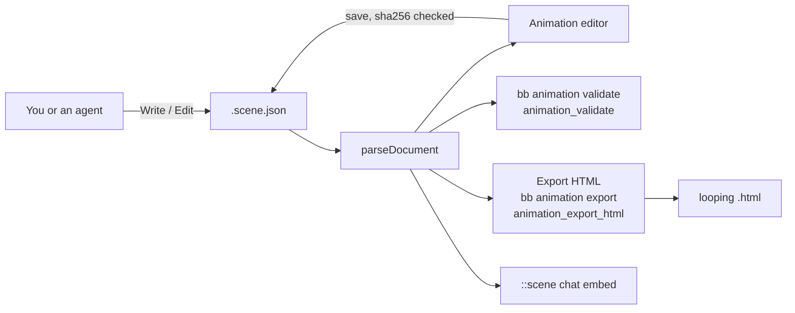

<div align="center">


# Animation

### Explain how a system behaves, one beat at a time.

Turn a technical diagram into a short, looping explainer that you or an agent write as plain JSON.<br>
Play it in BB, embed it in chat, or export one HTML page to share.


[Features](#features) · [Install](#install) · [Where to find it](#where-to-find-it) · [How it works](#how-it-works) · [CLI](#cli) · [Development](#development)

<br>



</div>

<br>

## The problem

You want to show how something behaves over time: a cache miss, a retry, a
queue draining. A static diagram shows the boxes but not the order things
happen in. A screen recording shows the order, but no one can review it in a
diff or ask an agent to fix step four.

With Animation, the explainer is a small `.scene.json` file in your repo. Each
step says what is true at that beat, and BB plays the steps in order. You or an
agent edit it like any other file.

|  | Without Animation | With Animation |
| --- | :---: | :---: |
| Play a diagram beat by beat in BB | ❌ | ✅ scrub, retime, loop |
| Keep it as a reviewable file in the repo | ❌ | ✅ canonical `.scene.json` |
| Have an agent check its own draft | ❌ | ✅ `animation_validate` |
| Show it inline in a chat reply | ❌ | ✅ `::scene` embed |
| Share it with someone outside BB | ❌ | ✅ one looping HTML file |

## Features

<table>
<tr>
<td width="50%" valign="top">

### 🎬 Step editor

The stage sits on top and the step strip below. Play, scrub, and drag a step
boundary to retime it. <kbd>Space</kbd> plays, <kbd>⌘S</kbd> saves, and
<kbd>⌘Z</kbd> / <kbd>⇧⌘Z</kbd> undo and redo.

</td>
<td width="50%" valign="top">

### 🎥 Motion built in

Parts rise in when a step reveals them, a step's changes sweep left to right,
and lit boxes glow. Add `focus` to a step and the stage zooms to the boxes it
is about. None of it is scripted.

</td>
</tr>
<tr>
<td valign="top">

### 🗣️ Narrated

Every step's caption shows under the stage in the editor, the chat embed and
the export, with a progress line along the bottom of the exported page.

</td>
<td valign="top">

### 🧭 Design notes

`animation_validate` looks at the scene for an agent that cannot see it:
clipped rows, overlapping boxes, captions too fast to read, nothing revealed
over time. Each note gives the exact value to set.

</td>
</tr>
<tr>
<td valign="top">

### 💬 Embed and export

`::scene{file="docs/flow.scene.json"}` plays the scene inside a message.
Export writes one self-contained page that loops on its own, from the editor,
the CLI, or an agent tool.

</td>
<td valign="top">

### 📄 Plain JSON, agent-ready

Parts plus an ordered list of steps, saved in a fixed key order so diffs stay
small. The bundled skill gives agents an eight-step recipe, a layout grid and
a worked example to copy.

</td>
</tr>
</table>

<div align="center">
<table>
<tr>
<td align="center"><br><sub><b>Both workers claim</b></sub></td>
<td align="center"><br><sub><b>Cache-aside read path</b></sub></td>
</tr>
</table>
</div>

## Install

```sh
bb plugin install git:https://github.com/MacHatter1/bb-plugin-animation --yes
```

That's it. Open any `.scene.json` file, or create one from a thread's
**Actions → New animation**.

<details>
<summary><b>Install from a local clone</b></summary>

```sh
git clone https://github.com/MacHatter1/bb-plugin-animation
cd bb-plugin-animation
npm install && bb plugin build
bb plugin install path:$PWD --yes
```

</details>

**Requirements**

- bb **0.43+** (Plugin SDK 0.4.88+)

## Where to find it

| Where | What |
| --- | --- |
| **File preview** | Open a `*.scene.json` or `*.anim.json` file to get the Animation editor. Other JSON files keep BB's usual preview. |
| **Thread Actions → New animation** | Creates a starter `.scene.json` in the thread's workspace and opens it. |
| **Command palette** | `Animation: create .scene.json` opens the same panel when a thread is open. |
| **Composer + menu** | **Embed scene** inserts a `::scene{file="…"}` directive. |
| **Chat messages** | `::scene{file="…"}` plays inline, with each step's caption beneath it. An optional height of 160 to 900 pixels goes after a space: `::scene{file="…" height=480}`. A comma between the two stops BB reading the line as a directive. |
| **Settings → Installed plugins → Animation** | A short how-to. There is nothing to configure. If another JSON viewer wins, pin this one under **Settings → File openers**. |

## How it works


```mermaid
flowchart LR
  A["You or an agent"] -->|"Write / Edit"| F[".scene.json"]
  F --> P["parseDocument"]
  P --> E["Animation editor"]
  P --> V["bb animation validate<br>animation_validate"]
  P --> X["Export HTML<br>bb animation export<br>animation_export_html"]
  P --> C["::scene chat embed"]
  E -->|"save, sha256 checked"| F
  X --> H["looping .html"]
```

- **States, not keyframes.** A step assigns a `state` and a `tone` to parts,
  and a 320 ms CSS transition interpolates. States are cumulative, so a step
  only lists what changes.
- **Motion comes from the renderer.** Showing a hidden part makes it rise into
  place, parts changed by one step start a beat apart in reading order, and a
  step's `focus` moves the camera. The file says what is true; it never says
  how to move.
- **Edges route themselves.** Neighbours get a straight line. An edge that
  skips a box arcs round it, and a request and its reply run in separate
  lanes.
- **One parser everywhere.** The editor, CLI, agent tools and export all use
  the same parser. It repairs near-misses with a warning. Errors block saving
  and export.
- **Canonical saves.** The editor writes a fixed key order, so saving an
  unchanged document gives identical bytes.
- **Same render inside and outside BB.** Export uses the editor's renderer and
  stage CSS, with the `stage.theme` palette or a fixed dark fallback.
- **What it will not do.** It has no GIF or MP4 export, parts cannot travel
  from one place to another, and text cannot change between steps. There are
  no font sizes beyond one title style for the heading.

## Safe by default

- 💾 **Saves never clobber.** The editor saves only if the file still has the
  hash it loaded, and only one save runs at a time. If the file changed on
  disk, nothing is written until you choose: **Reload** takes the version on
  disk, **Keep mine** overwrites it. `bb animation new` refuses to overwrite an
  existing file.
- 🧼 **Markup is sanitised.** `html` parts lose scripts, event handlers,
  `<style>` and any `url()` that is not `https:` or an inline image. The stage
  runs in a sandboxed iframe with scripts off.
- 📁 **Paths stay in the workspace.** The editor, chat embeds and **New
  animation** refuse paths that climb out of the workspace with `..`. An
  `htmlFile` must be relative and stay inside the workspace. Outside a
  workspace, the limit is the directory the CLI ran in, or the scene's own
  folder.
- 🌐 **No network calls.** The plugin reads and writes files through BB and
  nothing else. An exported page loads remote content only if your own markup
  names an `https:` image.
- 📝 **Export only replaces its own output.** Exporting again overwrites an
  earlier Animation export. Any other file at the output path, including the
  scene itself, is left alone and the export stops with an error.

## CLI

```sh
bb animation new docs/cache-read.scene.json         # create a starter scene
bb animation validate docs/cache-read.scene.json    # problems, plus design notes with fixes
bb animation export docs/cache-read.scene.json      # write docs/cache-read.html
bb animation export docs/cache-read.scene.json --out site/cache.html --json
```

<details>
<summary><b>All commands</b></summary>

| Command | Does |
| --- | --- |
| `new <path> [--json]` | Creates a starter scene. The path is rewritten to end in `.scene.json`. |
| `validate <path> [--seconds <n>] [--json]` | Parses the file and prints errors, warnings and design notes, each note with its fix. `--seconds` checks the length against the one asked for. Exits 1 on errors only; notes never fail it. |
| `export <path> [--out <html-path>] [--json]` | Writes standalone HTML next to the scene, or to `--out`. Refuses a file with parse errors or no steps, and will not overwrite a file that is not an earlier export. |

Relative paths resolve from the current directory, or from the thread's
workspace when there is no current directory.

</details>

**Agent tools:** `animation_validate({ filePath })` and
`animation_export_html({ filePath, outputPath? })`. The bundled
[skill](skills/animation/SKILL.md) teaches agents the part types, states,
geometry and canonical key order, and when a static diagram is the better
choice.

## Development

```sh
npm install
npm test
npm run typecheck
bb plugin build
bb plugin install path:$PWD --yes
bb plugin dev                      # rebuild and reload on every save
```

```
server.ts        CLI, agent tools and the RPC the editor calls
app.tsx          file opener, chat directive, New animation panel, settings page
contract.ts      RPC schema shared by server and app
src/core/        parser, serialiser, timeline, camera, design notes and HTML sanitiser
src/render/      scene SVG, stage CSS and the standalone export
src/components/  editor, stage frame and step strip
components/ui/   vendored BB UI primitives
samples/         two scenes to copy: a cache-aside read and a job queue with retry
skills/          the bundled agent skill
docs/            logo
screenshots/     README images
```

**Tests** are Vitest unit tests for the parser, serialiser and timeline, the
scene renderer, the camera and every design note, the HTML sanitiser and the
host path helpers. They also check that the shipped samples, the starter and
the skill's worked example pass the validator with no notes. A fake plugin host
also drives the CLI and agent tools end to end: create, validate, export,
refusing parse errors, and `.anim.json` files.

`PLUGIN_OVERVIEW.md` is the store listing. Keep it in step with
`bb.description` in `package.json`.

## Licence

[MIT](LICENSE). Includes a port of the MIT-licensed
[Nimbalyst Animation](https://nimbalyst.com/extensions/animation/) extension.
See [NOTICE](NOTICE).
